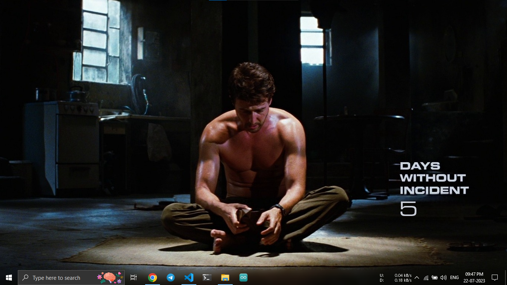
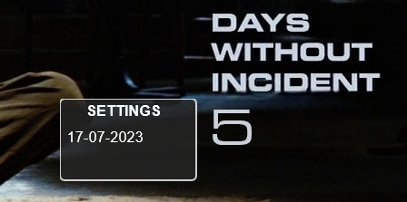

# Elabins Days Counter

    

## Description

"Elabins Days Counter" is a Rainmeter skin that allows you to count days up from a specified starting date. Inspired by the "Days without incident" concept from the Hulk 2008 movie, this days counter provides a fun and unique way to track time and important milestones.

## Features

- Count days up from a custom starting date.
- Visual display of the number of days.
- Click on the count value to open settings and customize the starting date.

## Usage

1. Download the latest release of "Elabins Days Counter" from the [GitHub Releases](https://github.com/e-labInnovations/RainMeter-ElabinsDaysCounter/releases) section.
2. Download the "Elabins Days Counter" skin.
3. Double-click the .rmskin file to install the skin in Rainmeter.
4. Right-click the Rainmeter icon in the system tray and select "Elabins Days Counter" to load the skin.

## Wallpaper Image

You can download the wallpaper image "Bruse Banner Sitting" by clicking [here](./images/Hulk%20WP.jpg).

## Screenshots

### Normal View

### Settings Opened

